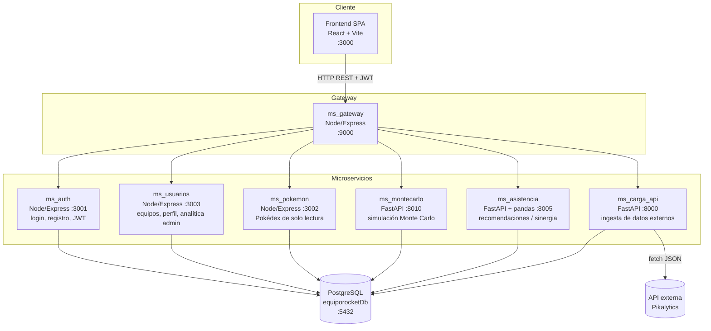

# EquipoRocket.pk

Plataforma web para el **análisis, gestión y construcción asistida de equipos competitivos** del videojuego *Pokémon Champions*.

Permite a los usuarios armar equipos, consultar la Pokédex, simular combates con Monte Carlo y recibir recomendaciones de compañeros/builds basadas en sinergia de tipos, todo respaldado por datos reales importados desde una API externa (Pikalytics).

## Arquitectura

El proyecto está organizado como un conjunto de **microservicios independientes**, cada uno con su propio `Dockerfile`, `docker-compose.yml` y dependencias. El frontend se comunica exclusivamente con el **API Gateway** (`ms_gateway`), que enruta cada petición al microservicio correspondiente.



Todos los servicios se comunican vía HTTP/REST sobre una red Docker compartida (`equiporocket-net`), usando una única base PostgreSQL (`equiporocketDb`) como almacén central.

## Componentes del repositorio

| Componente | Stack | Puerto (host) | Responsabilidad |
|---|---|---|---|
| [`Frontend_EquipoRocket.pk`](Frontend_EquipoRocket.pk) | React 19 + Vite + Nginx | 3000 | SPA: login/registro, Team Builder, Pokédex, simulaciones, asistente IA, panel admin |
| [`ms_gateway`](ms_gateway) | Node/Express | 9000 | API Gateway central: enruta `/api/*` del frontend a cada microservicio |
| [`ms_auth`](ms_auth) | Node/Express | 3001 | Registro y login de usuarios, emisión de JWT, gestión de usuarios (admin) |
| [`ms_usuarios`](ms_usuarios) | Node/Express | 3003 | CRUD de equipos, perfil de usuario, analítica admin |
| [`ms_pokemon`](ms_pokemon) | Node/Express | 3002 | Pokédex de solo lectura desde la BD |
| [`ms_db`](ms_db) | Node/Express + PostgreSQL | 4002 | Inicializa la BD `equiporocketDb` y aplica `schema.sql` |
| [`ms_carga_api`](ms_carga_api) | FastAPI (Python) | 8000 | Ingiere datos externos (Pikalytics), guarda crudo en `external_raw` y normaliza a tablas |
| [`ms_montecarlo`](ms_montecarlo) | FastAPI (Python) | 8010 | Simulación Monte Carlo de combates para optimizar configuraciones de equipo |
| [`ms_asistencia`](ms_asistencia) | FastAPI + pandas (Python) | 8005 | Recomendaciones de compañeros/builds vía matriz de sinergia por pares |

## Flujos principales

1. **Autenticación**: el frontend llama al gateway (`POST /api/auth/register`, `POST /api/auth/login`), que lo redirige a `ms_auth`. Este emite un JWT firmado con `JWT_SECRET`. Ese mismo secreto es validado por el middleware `requireAuth` de `ms_usuarios`.
2. **Gestión de equipos**: el frontend llama al gateway (`/api/teams`, CRUD de equipos) y a `/api/pokemon` (Pokédex), usando el JWT emitido por `ms_auth`.
3. **Ingesta de datos externos**: `ms_carga_api` consulta la API externa (Pikalytics), guarda el payload crudo en `external_raw.payload` (JSONB) y normaliza entradas hacia `pokemon`, `types`, `abilities`, `items`, `moves`, `spreads`, etc.
4. **Simulación Monte Carlo**: el frontend llama al gateway (`POST /api/montecarlo/simulate`). El servicio carga el "pool" desde la fila más reciente de `external_raw`, ejecuta la búsqueda Monte Carlo y persiste resultados en `battle_simulations`.
5. **Asistencia / sinergia**: el frontend llama al gateway (`/api/asistencia/analyze/team`, `/recommend/teammate`, etc.). Este servicio lee `external_raw` y construye en memoria una matriz de sinergia.

## Modelo de datos

El esquema relacional físico vive en [`ms_db/schema.sql`](ms_db/schema.sql). Tablas principales:

- **Catálogo Pokémon**: `pokemon`, `types`, `pokemon_types`, `abilities`, `items`, `moves`, `natures`, `spreads`.
- **Usuarios y equipos**: `users`, `regions`, `countries`, `formats`, `teams`, `team_pokemon`, `team_pokemon_moves`, `team_feedback`, `user_collections`.
- **Datos externos**: `external_raw` (payload crudo JSONB importado por `ms_carga_api`).
- **Sinergia**: `synergy_data` (sinergia por pares, alimentada por `ms_asistencia`).
- **Simulaciones**: `battle_simulations`, `simulation_iterations`, `optimized_configurations`, `configuration_comparisons`.

## Integridad de datos y borrado

### Soft-delete de equipos

El borrado de equipos es siempre un soft-delete (`UPDATE teams SET active = FALSE`). El trigger `trg_prevent_delete_teams` bloquea cualquier `DELETE` físico directo sobre `teams`.

### Supresión de usuarios (Ley N° 21.719)

Los administradores pueden **eliminar físicamente** a cualquier usuario desde el panel de administración. Al hacerlo, los datos personales del usuario son eliminados permanentemente y las FKs relacionadas quedan en NULL, preservando los datos analíticos:

| Tabla | Comportamiento al eliminar usuario |
|---|---|
| `teams` | `user_id` → NULL (equipos quedan anónimos) |
| `team_feedback` | `user_id` → NULL |
| `battle_simulations` | FKs de usuario → NULL |

La operación requiere que el administrador confirme con su contraseña y escriba el nombre del usuario. No es posible eliminar al último administrador activo del sistema.

## Cómo levantar el proyecto (Docker)

Requiere Docker Desktop con Docker Compose V2. Ver [`DOCKER_DEPLOYMENT.md`](DOCKER_DEPLOYMENT.md) para la guía completa.

**Levantar todo el stack:**

```bash
docker compose up -d
```

Descarga todas las imágenes desde Docker Hub (`benjamorenoo/*`), crea la red interna, levanta la base de datos y arranca todos los microservicios automáticamente.

**Poblar la base de datos** (una vez que los contenedores estén corriendo):

```bash
docker compose exec ms_db node seed.js
```

La aplicación queda disponible en **http://localhost:3000**.

## Frontend

SPA en React 19 + Vite, con Tailwind CSS v4, React Router y Recharts. Estructura relevante en `Frontend_EquipoRocket.pk/src`:

- `pages/`: `AuthPage`, `Home`, `TeamBuilder`, `MyTeams`, `MisPokemon`, `Simulations`, `UserProfile`, `AdminPanel`.
- `components/`: piezas reutilizables del Team Builder y widgets de analítica admin.
- `context/AuthContext.jsx`: estado de sesión/JWT compartido en toda la app.
- `services/api.js`: cliente Axios centralizado que apunta al gateway (`VITE_API_URL`).

Comandos: `npm run dev`, `npm run build`, `npm run lint`, `npm run test`, `npm run test:coverage`.

## Patrones de diseño aplicados

- **Arquitectura de microservicios**: cada carpeta de nivel superior es un servicio independiente comunicándose por HTTP/REST sobre `equiporocket-net`.
- **API Gateway**: `ms_gateway` centraliza el enrutamiento, reescritura de paths y reenvío del body JSON para todas las peticiones del frontend.
- **Separación en capas**: servicios Node usan `routes → controllers → (repository →) model → config/db.js`; servicios Python usan `app.py` → módulo de dominio → `api_client.py`.
- **Patrón Repositorio**: `ms_usuarios/src/repositories/teamRepository.js` encapsula el acceso a datos de equipos.

## Pruebas

Cada microservicio incluye su propia carpeta `tests/` (Jest para servicios Node, pytest para servicios Python) y el frontend usa Vitest con `@vitest/coverage-v8`. La matriz y el plan de pruebas están en [`matriz_pruebas.md`](matriz_pruebas.md) y [`plan_pruebas.md`](plan_pruebas.md).

## Documentación adicional

- [`DOCKER_DEPLOYMENT.md`](DOCKER_DEPLOYMENT.md) — guía de despliegue con Docker.
- READMEs por microservicio (`ms_*/README.md`) — endpoints, variables de entorno y ejecución local de cada servicio.
