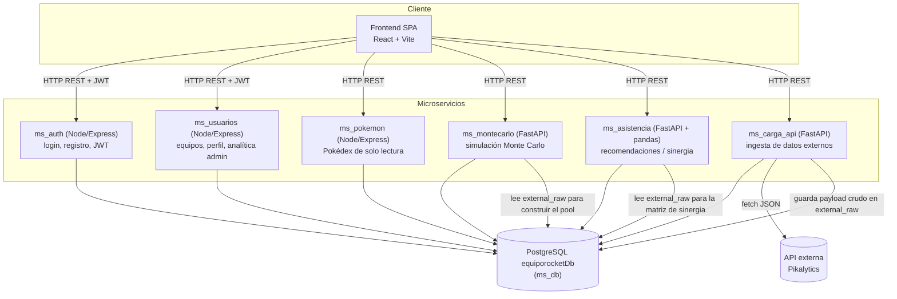

# EquipoRocket.pk

Plataforma web para el **análisis, gestión y construcción asistida de equipos competitivos** del videojuego *Pokémon Champions*.

Permite a los usuarios armar equipos, consultar la Pokédex, simular combates con Monte Carlo y recibir recomendaciones de compañeros/builds basadas en sinergia de tipos, todo respaldado por datos reales importados desde una API externa (Pikalytics).

## Arquitectura

El proyecto está organizado como un conjunto de **microservicios independientes**, cada uno con su propio `Dockerfile`, `docker-compose.yml` y dependencias. No existe actualmente un API Gateway central en uso: el **frontend actúa como orquestador**, llamando a cada microservicio directamente a través de su URL base (`VITE_MS_*_URL`). El servicio `ms_gateway` existe en el repositorio como proxy reverso opcional, pero no es parte del flujo implementado por defecto.



Todos los servicios se comunican vía HTTP/REST sobre una red Docker compartida (`equiporocket-net`), usando una única base PostgreSQL (`equiporocketDb`) como almacén central.

Documentación de arquitectura más detallada (patrones de diseño, capas, modelo de datos): [`docs/ARQUITECTURA.md`](docs/ARQUITECTURA.md).

## Componentes del repositorio

| Componente | Stack | Puerto por defecto | Responsabilidad |
|---|---|---|---|
| [`Frontend_EquipoRocket.pk`](Frontend_EquipoRocket.pk) | React 19 + Vite | 5173 | SPA: login/registro, Team Builder, Pokédex, simulaciones, asistente IA, panel admin |
| [`ms_auth`](ms_auth) | Node/Express | 3001 | Registro y login de usuarios, emisión de JWT |
| [`ms_usuarios`](ms_usuarios) | Node/Express | 3003 | CRUD de equipos, perfil de usuario, analítica admin (patrón Repositorio) |
| [`ms_pokemon`](ms_pokemon) | Node/Express | 3002 | Pokédex de solo lectura desde la BD |
| [`ms_db`](ms_db) | Node/Express + PostgreSQL | 4002 | Inicializa la BD `equiporocketDb` y aplica `schema.sql` |
| [`ms_carga_api`](ms_carga_api) | FastAPI (Python) | 8000 | Ingiere datos externos (Pikalytics), guarda crudo en `external_raw` y normaliza a tablas (`pokemon`, `types`, `moves`, etc.) |
| [`ms_montecarlo`](ms_montecarlo) | FastAPI (Python) | 8010 | Simulación Monte Carlo de combates para optimizar configuraciones de equipo |
| [`ms_asistencia`](ms_asistencia) | FastAPI + pandas (Python) | 8005 | Recomendaciones de compañeros/builds vía matriz de sinergia por pares |
| [`ms_gateway`](ms_gateway) | Node/Express | 8000 | Proxy reverso opcional hacia todos los microservicios (no usado por el frontend actualmente) |

## Flujos principales

1. **Autenticación**: el frontend llama a `ms_auth` (`POST /api/auth/register`, `POST /api/auth/login`), que emite un JWT firmado con `JWT_SECRET`. Ese mismo secreto es validado por el middleware `requireAuth` de `ms_usuarios`.
2. **Gestión de equipos**: el frontend llama directamente a `ms_usuarios` (`/api/teams`, CRUD de equipos) y a `ms_pokemon` (Pokédex), usando el JWT emitido por `ms_auth`.
3. **Ingesta de datos externos**: `ms_carga_api` consulta la API externa (Pikalytics, vía `API_URL`), guarda el payload crudo en `external_raw.payload` (JSONB) y normaliza entradas hacia `pokemon`, `types`, `abilities`, `items`, `moves`, `spreads`, etc.
4. **Simulación Monte Carlo**: el frontend llama directamente a `ms_montecarlo` (`POST /simulate`). El servicio carga el "pool" de Pokémon desde la fila más reciente de `external_raw`, ejecuta la búsqueda Monte Carlo y persiste resultados en `battle_simulations`, `simulation_iterations`, `optimized_configurations` y `configuration_comparisons`.
5. **Asistencia / sinergia**: el frontend llama directamente a `ms_asistencia` (`/analyze/team`, `/recommend/teammate`, `/recommend/build`, `/store/synergy`). Este servicio lee `external_raw` y construye en memoria una matriz de sinergia, persistiendo sinergias por pares en `synergy_data`.

> `ms_montecarlo` y `ms_asistencia` son independientes entre sí (no se llaman uno a otro); cada uno lee `external_raw` directamente desde `ms_db`. Es el **frontend** quien orquesta las llamadas a cada microservicio según la pantalla (Team Builder, Simulación, Asistente IA, etc.).

## Modelo de datos

El esquema relacional físico vive en [`ms_db/schema.sql`](ms_db/schema.sql) y se aplica vía `POST /init` en `ms_db`. Tablas principales:

- **Catálogo Pokémon**: `pokemon`, `types`, `pokemon_types`, `abilities`, `pokemon_abilities`, `items`, `moves`, `pokemon_moves`, `natures`, `spreads`, `pokemon_spreads`.
- **Usuarios y equipos**: `users`, `regions`, `countries`, `formats`, `teams`, `team_pokemon` (configuración completa de cada Pokémon dentro de un equipo: habilidad, item, spread, movimientos), `team_pokemon_moves`, `team_feedback`, `user_collections`.
- **Datos externos**: `external_raw` (payload crudo JSONB importado por `ms_carga_api`).
- **Sinergia**: `synergy_data` (sinergia por pares, alimentada por `ms_asistencia`).
- **Simulaciones**: `battle_simulations`, `simulation_iterations`, `optimized_configurations`, `configuration_comparisons` (trazabilidad completa de cada corrida Monte Carlo).

## Cómo levantar el proyecto localmente (Docker)

Requiere Docker Desktop con Docker Compose V2.

1. **Crear la red Docker compartida** (una sola vez):

   ```bash
   # Linux/macOS
   ./scripts/create_network.sh
   # Windows PowerShell
   .\scripts\create_network.ps1
   ```

2. **Levantar cada servicio** desde su propia carpeta (orden recomendado: `ms_db` primero para inicializar la base de datos, luego el resto):

   ```bash
   cd ms_db && cp .env.example .env  # editar credenciales
   docker compose up -d --build
   curl -X POST http://localhost:4002/init   # crea la BD y aplica el esquema

   cd ../ms_auth && cp .env.example .env
   docker compose up -d --build

   cd ../ms_usuarios && docker compose up -d --build
   cd ../ms_pokemon && cp .env.template .env && docker compose up -d --build
   cd ../ms_carga_api && cp .env.example .env && docker compose up -d --build
   cd ../ms_montecarlo && docker compose up -d --build
   cd ../ms_asistencia && docker compose up -d --build

   cd ../Frontend_EquipoRocket.pk && cp .env.example .env
   docker compose up -d --build
   ```

3. **Detener un servicio**: desde su carpeta, `docker compose down`.

Más detalle en [`DOCKER_DEPLOYMENT.md`](DOCKER_DEPLOYMENT.md) y [`DOCKER_DEPLOYMENT_GUIDE.md`](DOCKER_DEPLOYMENT_GUIDE.md). Cada microservicio también documenta cómo correrlo de forma local sin Docker (venv + `uvicorn`, o `npm install` + `node`) en su propio `README.md`.

## Frontend

SPA en React 19 + Vite, con Tailwind CSS, React Router y Recharts para gráficos. Estructura relevante en `Frontend_EquipoRocket.pk/src`:

- `pages/`: `AuthPage`, `Login`, `Register`, `Home`, `TeamBuilder`, `MyTeams`, `MisPokemon`, `Simulations`, `UserProfile`, `AdminPanel`.
- `components/`: piezas reutilizables del Team Builder (`PokemonSlot`, `SearchModal`, `SpreadModal`, `AssistedBuilderModal`, `TypeCoverageChart`, etc.) y widgets de analítica admin (`AdminPerformance`, `AdminSimulationsAnalytics`, `AdminUsageByCountry`, `AdminUsersByMonth`).
- `context/AuthContext.jsx`: estado de sesión/JWT compartido en toda la app.
- `services/api.js`: cliente Axios centralizado que apunta a las URLs base de cada microservicio (`VITE_MS_*_URL`).

Comandos (`Frontend_EquipoRocket.pk/package.json`): `npm run dev`, `npm run build`, `npm run lint`, `npm run test` (Vitest + Testing Library).

## Patrones de diseño aplicados

- **Arquitectura de microservicios**: cada carpeta de nivel superior es un servicio independiente con su propio Dockerfile/compose y dependencias, comunicándose por HTTP/REST sobre `equiporocket-net`.
- **Separación en capas**:
  - Servicios Node (`ms_auth`, `ms_usuarios`, `ms_pokemon`, `ms_db`): `routes → controllers → (repository →) model → config/db.js`.
  - Servicios Python (`ms_montecarlo`, `ms_asistencia`, `ms_carga_api`): `app.py` (endpoints FastAPI) → módulo de dominio (`montecarlo.py`/`simulator.py`, `engine.py`) → `api_client.py` (acceso a datos).
- **Patrón Repositorio**: `ms_usuarios/src/repositories/teamRepository.js` encapsula el acceso a datos de equipos detrás de una interfaz propia, delegando en `models/teamModel.js`.

## Pruebas

Cada microservicio incluye su propia carpeta `tests/` (Jest para servicios Node, pytest para servicios Python) y el frontend usa Vitest. La matriz de pruebas completa del proyecto y el plan de pruebas están documentados en [`matriz_pruebas.md`](matriz_pruebas.md) y [`plan_pruebas.md`](plan_pruebas.md).

## Documentación adicional

- [`docs/ARQUITECTURA.md`](docs/ARQUITECTURA.md) — diagrama de componentes, flujos detallados y patrones de diseño.
- [`DOCKER_DEPLOYMENT.md`](DOCKER_DEPLOYMENT.md) / [`DOCKER_DEPLOYMENT_GUIDE.md`](DOCKER_DEPLOYMENT_GUIDE.md) — guías de despliegue con Docker.
- READMEs por microservicio (`ms_*/README.md`) — endpoints, variables de entorno y ejecución local de cada servicio.
