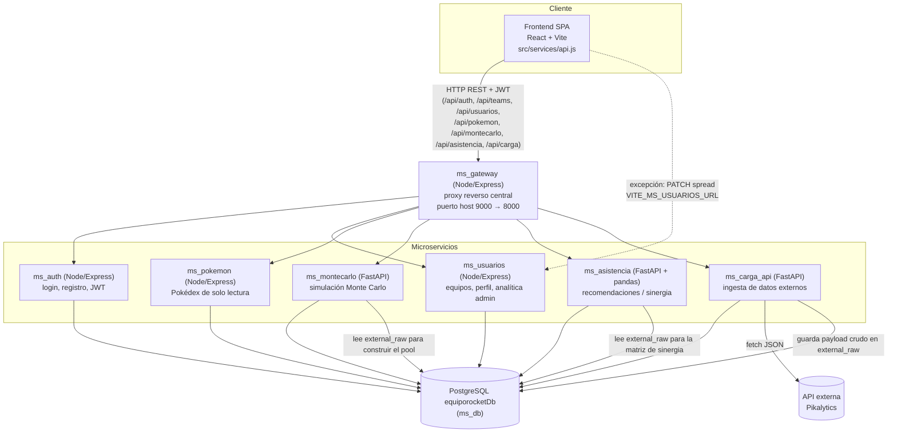

# EquipoRocket.pk

Plataforma web para el **análisis, gestión y construcción asistida de equipos competitivos** del videojuego *Pokémon Champions*.

Permite a los usuarios armar equipos, consultar la Pokédex, simular combates con Monte Carlo y recibir recomendaciones de compañeros/builds basadas en sinergia de tipos, todo respaldado por datos reales importados desde una API externa (Pikalytics).

## Arquitectura

El proyecto está organizado como un conjunto de **microservicios independientes**, cada uno con su propio `Dockerfile`, `docker-compose.yml` y dependencias. El **frontend pasa por el API Gateway (`ms_gateway`)** como punto de entrada único para prácticamente todas las llamadas (`src/services/api.js` → `gatewayAPI`, que apunta a `VITE_API_URL`); el gateway reenvía cada request al microservicio correspondiente (`ms_gateway/app.js`). La única excepción documentada es la asignación de *spread* en el Team Builder, que llama directamente a `ms_usuarios` vía `VITE_MS_USUARIOS_URL` (`TeamBuilder.jsx`).



Todos los servicios se comunican vía HTTP/REST sobre una red Docker compartida (`equiporocket-net`), usando una única base PostgreSQL (`equiporocketDb`) como almacén central.

Documentación de arquitectura más detallada (patrones de diseño, capas, modelo de datos): [`docs/ARQUITECTURA.md`](docs/ARQUITECTURA.md).

## Componentes del repositorio

| Componente | Stack | Puerto por defecto | Responsabilidad |
|---|---|---|---|
| [`Frontend_EquipoRocket.pk`](Frontend_EquipoRocket.pk) | React 19 + Vite | 5173 | SPA: login/registro, Team Builder, Pokédex, simulaciones, asistente IA, panel admin |
| [`ms_auth`](ms_auth) | Node/Express | 3001 | Registro y login de usuarios, emisión de JWT |
| [`ms_usuarios`](ms_usuarios) | Node/Express | 3003 | CRUD de equipos, perfil de usuario, analítica admin (patrón Repositorio) |
| [`ms_pokemon`](ms_pokemon) | Node/Express | 3002 | Pokédex de solo lectura desde la BD |
| [`ms_db`](ms_db) | Node/Express + PostgreSQL | 4002 | Inicializa la BD `equiporocketDb` y aplica `schema.sql` |
| [`ms_carga_api`](ms_carga_api) | FastAPI (Python) | 8000 | Ingiere datos externos (Pikalytics), guarda crudo en `external_raw` y normaliza a tablas (`pokemon`, `types`, `moves`, etc.) |
| [`ms_montecarlo`](ms_montecarlo) | FastAPI (Python) | 8010 | Simulación Monte Carlo de combates para optimizar configuraciones de equipo |
| [`ms_asistencia`](ms_asistencia) | FastAPI + pandas (Python) | 8005 | Recomendaciones de compañeros/builds vía matriz de sinergia por pares |
| [`ms_gateway`](ms_gateway) | Node/Express | 9000 (host) → 8000 (contenedor) | **API Gateway**: punto de entrada único usado por el frontend (`VITE_API_URL`), enruta cada request hacia el microservicio correspondiente |

## Flujos principales

Todas las rutas listadas abajo pasan por el **API Gateway** (`ms_gateway`, `/api/...`), que reenvía cada request al microservicio correspondiente (ver tabla de rutas en [`ms_gateway/README.md`](ms_gateway/README.md)).

1. **Autenticación**: el frontend llama a `POST /api/auth/register` y `POST /api/auth/login` (gateway → `ms_auth`), que emite un JWT firmado con `JWT_SECRET`. Ese mismo secreto es validado por el middleware `requireAuth` de `ms_usuarios`.
2. **Gestión de equipos**: el frontend usa `/api/teams` y `/api/usuarios/*` (gateway → `ms_usuarios`) y `/api/pokemon` (gateway → `ms_pokemon`), usando el JWT emitido por `ms_auth`. Excepción puntual: la asignación de *spread* de un Pokémon ya guardado en un equipo (`TeamBuilder.jsx`) llama directamente a `ms_usuarios` vía `VITE_MS_USUARIOS_URL`, sin pasar por el gateway.
3. **Ingesta de datos externos**: `ms_carga_api` (`/api/carga/load` vía gateway) consulta la API externa (Pikalytics, vía `API_URL`), guarda el payload crudo en `external_raw.payload` (JSONB) y normaliza entradas hacia `pokemon`, `types`, `abilities`, `items`, `moves`, `spreads`, etc.
4. **Simulación Monte Carlo**: el frontend llama a `POST /api/montecarlo/simulate` (gateway → `ms_montecarlo`). El servicio carga el "pool" de Pokémon desde la fila más reciente de `external_raw`, ejecuta la búsqueda Monte Carlo y persiste resultados en `battle_simulations`, `simulation_iterations`, `optimized_configurations` y `configuration_comparisons`.
5. **Asistencia / sinergia**: el frontend llama a `/api/asistencia/analyze/team`, `/recommend/teammate`, `/recommend/build` (gateway → `ms_asistencia`). Este servicio lee `external_raw` y construye en memoria una matriz de sinergia, persistiendo sinergias por pares en `synergy_data` (`/store/synergy`).

> `ms_montecarlo` y `ms_asistencia` son independientes entre sí (no se llaman uno a otro); cada uno lee `external_raw` directamente desde `ms_db`. Es el **frontend**, a través del **gateway**, quien orquesta las llamadas a cada microservicio según la pantalla (Team Builder, Simulación, Asistente IA, etc.).

## Modelo de datos

El esquema relacional físico vive en [`ms_db/schema.sql`](ms_db/schema.sql) y se aplica vía `POST /init` en `ms_db`. Tablas principales:

- **Catálogo Pokémon**: `pokemon`, `types`, `pokemon_types`, `abilities`, `pokemon_abilities`, `items`, `moves`, `pokemon_moves`, `natures`, `spreads`, `pokemon_spreads`.
- **Usuarios y equipos**: `users`, `regions`, `countries`, `formats`, `teams`, `team_pokemon` (configuración completa de cada Pokémon dentro de un equipo: habilidad, item, spread, movimientos), `team_pokemon_moves`, `team_feedback`, `user_collections`.
- **Datos externos**: `external_raw` (payload crudo JSONB importado por `ms_carga_api`).
- **Sinergia**: `synergy_data` (sinergia por pares, alimentada por `ms_asistencia`).
- **Simulaciones**: `battle_simulations`, `simulation_iterations`, `optimized_configurations`, `configuration_comparisons` (trazabilidad completa de cada corrida Monte Carlo).

## Cómo levantar el proyecto localmente (Docker)

> No existe un único `docker-compose.yml` en la raíz: cada carpeta tiene su propio `Dockerfile` + `docker-compose.yml`, y todos comparten la red externa `equiporocket-net`. Esta es la secuencia completa y verificada para dejar el sistema operativo de punta a punta (BD → microservicios → **gateway** → frontend). El orden importa: `ms_gateway` y el frontend necesitan que el resto de servicios ya estén arriba.

Requiere Docker Desktop con Docker Compose V2.

### 1. Crear la red Docker compartida (una sola vez)

```bash
# Linux/macOS
./scripts/create_network.sh
# Windows PowerShell
.\scripts\create_network.ps1
```

### 2. Base de datos — `ms_db`

```bash
cd ms_db
cp .env.example .env        # editar PGPASSWORD si no usas el valor por defecto
docker compose up -d --build
curl -X POST http://localhost:4002/init   # crea equiporocketDb y aplica schema.sql
```

### 3. Microservicios de negocio

Cada uno ya trae un `.env` con valores por defecto compatibles con `ms_db`; solo edítalos si cambiaste credenciales en el paso anterior.

```bash
cd ../ms_auth        && docker compose up -d --build
cd ../ms_usuarios     && docker compose up -d --build
cd ../ms_pokemon      && docker compose up -d --build
cd ../ms_carga_api    && docker compose up -d --build
cd ../ms_montecarlo   && docker compose up -d --build
cd ../ms_asistencia   && docker compose up -d --build
```

(Opcional pero recomendado) Cargar el catálogo Pokémon desde la API externa antes de usar el Team Builder, la simulación Monte Carlo o el asistente de sinergia:

```bash
curl -X POST http://localhost:8000/load
```

### 4. API Gateway — `ms_gateway`

El frontend habla con todos los microservicios **a través del gateway**; sin este paso el frontend no podrá autenticar ni cargar datos.

```bash
cd ../ms_gateway
cp .env.example .env
docker compose up -d --build
curl http://localhost:9000/health   # debe responder { "status": "healthy", ... }
```

### 5. Frontend

`VITE_API_URL` se incrusta en el build de Vite, así que debe quedar configurado **antes** de `docker compose up --build`.

```bash
cd ../Frontend_EquipoRocket.pk
cp .env.example .env
# .env -> VITE_API_URL=http://localhost:9000   (puerto host del gateway, paso 4)
docker compose up -d --build
```

Abrir **http://localhost:3000** en el navegador.

### Verificación rápida de extremo a extremo

```bash
curl http://localhost:9000/gateway-info          # confirma que el gateway ve todos los microservicios
curl http://localhost:9000/api/pokemon?limit=5    # gateway -> ms_pokemon -> Postgres
```

### Detener / limpiar

Desde la carpeta de cada servicio: `docker compose down` (agregar `-v` solo si además quieres borrar los volúmenes/datos de Postgres en `ms_db/pgdata`).

### Ejecución local sin Docker (desarrollo)

Cada microservicio documenta en su propio `README.md` cómo levantarlo sin contenedores (venv + `uvicorn` para los servicios Python, `npm install` + `node`/`npm start` para los Node):

- [`ms_db`](ms_db/README.md) · [`ms_auth`](ms_auth/README.md) · [`ms_usuarios`](ms_usuarios/README.md) · [`ms_pokemon`](ms_pokemon/README.md) · [`ms_gateway`](ms_gateway/README.md)
- [`ms_carga_api`](ms_carga_api/README.md) · [`ms_montecarlo`](ms_montecarlo/README.md) · [`ms_asistencia`](ms_asistencia/README.md)
- [`Frontend_EquipoRocket.pk`](Frontend_EquipoRocket.pk/README.md) (`npm run dev`, sirve en `http://localhost:5173`)

Más detalle (incluyendo troubleshooting de Docker) en [`DOCKER_DEPLOYMENT.md`](DOCKER_DEPLOYMENT.md) y [`DOCKER_DEPLOYMENT_GUIDE.md`](DOCKER_DEPLOYMENT_GUIDE.md). Esta última asume un `docker-compose.yml` único en la raíz que **no existe en este repositorio**; usa esa guía solo como referencia de rutas/puertos del gateway y troubleshooting — la secuencia de arranque real es la de esta sección.

## Frontend

SPA en React 19 + Vite, con Tailwind CSS, React Router y Recharts para gráficos. Estructura relevante en `Frontend_EquipoRocket.pk/src`:

- `pages/`: `AuthPage`, `Login`, `Register`, `Home`, `TeamBuilder`, `MyTeams`, `MisPokemon`, `Simulations`, `UserProfile`, `AdminPanel`.
- `components/`: piezas reutilizables del Team Builder (`PokemonSlot`, `SearchModal`, `SpreadModal`, `AssistedBuilderModal`, `TypeCoverageChart`, etc.) y widgets de analítica admin (`AdminPerformance`, `AdminSimulationsAnalytics`, `AdminUsageByCountry`, `AdminUsersByMonth`).
- `context/AuthContext.jsx`: estado de sesión/JWT compartido en toda la app.
- `services/api.js`: cliente Axios centralizado (`gatewayAPI`) que apunta al API Gateway vía `VITE_API_URL` e inyecta el JWT en cada request.

Comandos (`Frontend_EquipoRocket.pk/package.json`): `npm run dev`, `npm run build`, `npm run lint`, `npm run test` (Vitest + Testing Library).

## Patrones de diseño aplicados

- **Arquitectura de microservicios**: cada carpeta de nivel superior es un servicio independiente con su propio Dockerfile/compose y dependencias, comunicándose por HTTP/REST sobre `equiporocket-net`.
- **Separación en capas**:
  - Servicios Node (`ms_auth`, `ms_usuarios`, `ms_pokemon`, `ms_db`): `routes → controllers → (repository →) model → config/db.js`.
  - Servicios Python (`ms_montecarlo`, `ms_asistencia`, `ms_carga_api`): `app.py` (endpoints FastAPI) → módulo de dominio (`montecarlo.py`/`simulator.py`, `engine.py`) → `api_client.py` (acceso a datos).
- **Patrón Repositorio**: `ms_usuarios/src/repositories/teamRepository.js` encapsula el acceso a datos de equipos detrás de una interfaz propia, delegando en `models/teamModel.js`.

## Pruebas

Cada microservicio incluye su propia carpeta `tests/` (Jest para servicios Node, pytest para servicios Python) y el frontend usa Vitest. La matriz de pruebas completa del proyecto y el plan de pruebas están documentados en [`matriz_pruebas.md`](matriz_pruebas.md) y [`plan_pruebas.md`](plan_pruebas.md).

## Documentación adicional

- [`docs/ARQUITECTURA.md`](docs/ARQUITECTURA.md) — diagrama de componentes, flujos detallados y patrones de diseño.
- [`DOCKER_DEPLOYMENT.md`](DOCKER_DEPLOYMENT.md) / [`DOCKER_DEPLOYMENT_GUIDE.md`](DOCKER_DEPLOYMENT_GUIDE.md) — guías de despliegue con Docker.
- READMEs por microservicio (`ms_*/README.md`) — endpoints, variables de entorno y ejecución local de cada servicio.
