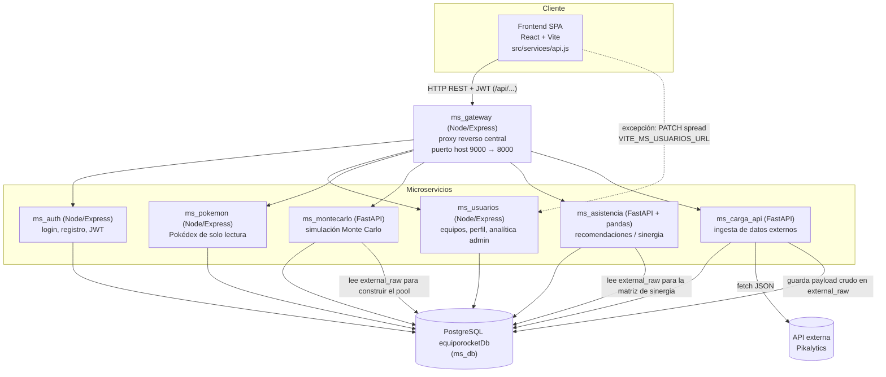

# Arquitectura de EquipoRocket.pk

> Diagrama de arquitectura y patrones de diseño aplicados (corrección punto 3:
> "no hay un diagrama de arquitectura claro que muestre cómo interactúan los
> microservicios"). El diagrama refleja la arquitectura **implementada**,
> verificada directamente en el código de cada servicio.

## Diagrama de componentes y flujo de llamadas

## Descripción de los flujos

Todas las rutas pasan por el **API Gateway** (`ms_gateway`, ver [`ms_gateway/README.md`](../ms_gateway/README.md)), salvo la excepción puntual indicada en el punto 2.

1. **Autenticación**: el frontend llama a `/api/auth/register` y `/api/auth/login` (gateway → `ms_auth`), que emite un JWT firmado con `JWT_SECRET`. Ese mismo secreto es validado por el middleware `requireAuth` de `ms_usuarios`.
2. **Gestión de equipos**: el frontend usa `/api/teams` y `/api/usuarios/*` (gateway → `ms_usuarios`) y `/api/pokemon` (gateway → `ms_pokemon`) usando el JWT emitido por `ms_auth`. Excepción: la asignación de *spread* de un Pokémon ya guardado en un equipo (`TeamBuilder.jsx`) llama directamente a `ms_usuarios` vía `VITE_MS_USUARIOS_URL`, sin pasar por el gateway.
3. **Ingesta de datos externos**: `ms_carga_api` (`/api/carga/load` vía gateway) consulta la API externa (Pikalytics, vía `API_URL`), guarda el payload crudo en `external_raw.payload` (JSONB) y normaliza entradas hacia `pokemon`, `types`, `abilities`, `items`, `moves`, `spreads`, etc.
4. **Simulación Monte Carlo**: el frontend llama a `POST /api/montecarlo/simulate` (gateway → `ms_montecarlo`). Este servicio carga el "pool" de Pokémon desde la fila más reciente de `external_raw`, ejecuta la búsqueda Monte Carlo (`montecarlo.search_best_team` + `simulator.simulate_battle`) y persiste resultados en `battle_simulations`, `simulation_iterations`, `optimized_configurations` y `configuration_comparisons` (ver [`ms_montecarlo/README.md`](../ms_montecarlo/README.md)).
5. **Asistencia / sinergia**: el frontend llama a `/api/asistencia/analyze/team`, `/recommend/teammate`, `/recommend/build` (gateway → `ms_asistencia`). Este servicio también lee `external_raw` y construye en memoria una matriz de sinergia (`engine.PokemonAnalyticsEngine`), persistiendo sinergias por pares en `synergy_data` vía `/store/synergy`.

> **Nota:** `ms_montecarlo` y `ms_asistencia` son servicios independientes que **no se llaman entre sí**; cada uno lee `external_raw` directamente desde `ms_db`. De igual forma, `ms_usuarios` no invoca a `ms_montecarlo`: es el **frontend**, a través del **API Gateway** (`ms_gateway`), quien orquesta las llamadas a cada microservicio según la pantalla (Team Builder, Simulación, Asistente IA, etc.).

## Patrones de diseño aplicados

### 1. Arquitectura de microservicios
Cada carpeta de nivel superior (`ms_auth`, `ms_usuarios`, `ms_pokemon`, `ms_db`, `ms_montecarlo`, `ms_carga_api`, `ms_asistencia`, `ms_gateway`, `Frontend_EquipoRocket.pk`) es un servicio independiente, con su propio `docker-compose.yml`, `Dockerfile` y dependencias (`package.json` o `requirements.txt`). Se comunican por HTTP/REST sobre una red Docker compartida (`equiporocket-net`). El frontend usa el **API Gateway** (`ms_gateway`) como punto de entrada único (`VITE_API_URL`), que enruta cada request hacia el microservicio correspondiente.

### 2. Separación de responsabilidades (capas)
- **Servicios Node** (`ms_auth`, `ms_usuarios`, `ms_pokemon`, `ms_db`): siguen el patrón `routes → controllers → (repository →) model → config/db.js`. Las rutas exponen los endpoints HTTP, los controllers contienen la lógica de negocio/validación, los models encapsulan el acceso SQL y `config/db.js` centraliza el pool de conexión a Postgres.
- **Servicios Python** (`ms_montecarlo`, `ms_asistencia`, `ms_carga_api`): siguen el patrón `app.py` (endpoints FastAPI) → módulo de dominio (`montecarlo.py` / `simulator.py`, `engine.py`) → `api_client.py` (acceso a datos externos/DB). La lógica de simulación y análisis está desacoplada de la capa HTTP.

### 3. Patrón Repositorio
`ms_usuarios/src/repositories/teamRepository.js` implementa el patrón Repositorio: encapsula el acceso a datos de equipos (`teams`, `team_pokemon`, `team_pokemon_moves`) detrás de una interfaz propia, delegando en `models/teamModel.js`. El controller de equipos (`teamsController.js`) depende del repositorio, no de SQL crudo, lo que facilita testear o sustituir la fuente de datos. El resto de controllers de `ms_usuarios` (admin, data, user) consultan el `pool` de conexión directamente vía `query(...)` — una excepción documentada, no un patrón generalizado en todo el servicio.

## Modelo de datos

`ms_db/schema.sql` define el **modelo relacional físico** del sistema, en notación de tabla estilo "crow's foot" (claves primarias/foráneas y cardinalidades implícitas en los FK), no un DER conceptual abstracto. Puntos relevantes documentados allí y en [`ms_db/README.md`](../ms_db/README.md):

- `team_pokemon` (conceptualmente **"team_member_configuration"**): guarda la configuración completa (habilidad, item, spread, movimientos) de cada Pokémon dentro de un equipo.
- `synergy_data`: sinergia **por pares**, alimentada desde datos externos (Pikalytics) vía `ms_asistencia` — ver limitaciones en [`ms_asistencia/README.md`](../ms_asistencia/README.md).
- `battle_simulations`, `simulation_iterations`, `optimized_configurations`, `configuration_comparisons`: trazabilidad completa de cada simulación Monte Carlo (semilla, versión de algoritmo, iteraciones individuales) y de las recomendaciones generadas — ver [`ms_montecarlo/README.md`](../ms_montecarlo/README.md).
